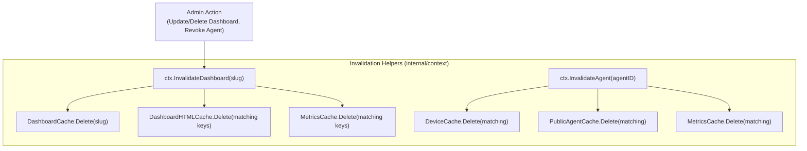

# CertainStats — Caching Code of Conduct & Standards

> **Version:** 1.0 · **Date:** 2026-08-25 · **Scope:** Global Repository Architecture

---

## 1. Core Philosophy

CertainStats is a high-performance, real-time infrastructure monitoring platform. Caching must adhere to three foundational principles:

1. **Zero Redundancy**: All caching logic (lookup, pre-compression, serving, expiration, and invalidation) lives exclusively in `internal/context`. No caller package should ever re-implement compression checks or manual `sync.Map` loops.
2. **Pre-Compression at Ingestion**: Cache entries pre-compress payloads once using both **Zstandard (`zstd`)** and **Gzip (`gzip`)** upon storage via `NewCacheEntry()`, eliminating runtime compression overhead during read spikes.
3. **Deterministic TTL**: All public telemetry APIs and public server-side rendered HTML pages use a uniform **60-second TTL** (`ctx.DefaultCacheTTL`).
4. **No ETags for Volatile Telemetry**: Real-time monitoring data updates at sub-minute intervals. Calculating SHA256 ETags adds useless CPU overhead and causes cache thrashing. ETags are forbidden on telemetry endpoints.

---

## 2. Canonical Data Structure

All in-memory cached responses stored in global `sync.Map` instances must use `*context.CacheEntry`:

```go
type CacheEntry struct {
    Payload     []byte        // Raw uncompressed payload (JSON or HTML)
    GzipPayload []byte        // Pre-compressed gzip payload
    ZstdPayload []byte        // Pre-compressed zstd payload
    ExpiresAt   time.Time     // Absolute expiration time (time.Now().Add(ttl))
}
```

---

## 3. Standard Global Cache Registries (`internal/context`)

| Cache Variable | Key Format | Value Type | Usage Scope |
|---|---|---|---|
| `ctx.MetricsCache` | `slug_agentID_metric_hours` | `*ctx.CacheEntry` | Query results for `/api/metrics` |
| `ctx.DashboardCache` | `slug` | `*ctx.CacheEntry` | JSON payload for `/api/public/dashboard` |
| `ctx.DashboardHTMLCache` | `html_dash_slug` / `html_agent_slug_pubID` | `*ctx.CacheEntry` | Rendered SSR HTML for public dashboards |
| `ctx.PublicAgentCache` | `dashboardID_publicAgentID` | `*ctx.PublicAgentCacheEntry` | Fast lookup mapping public ID to internal agent |
| `ctx.DeviceCache` | `device_id` | `*agent.DeviceIdentity` | Auth token lookup for agent ingestion |
| `ctx.StaticCache` | `relative_file_path` | `*ctx.CacheEntry` | Pre-compressed static assets (`/static/*`) in RAM |

---

## 4. The Standard Access Pattern

Every handler that interacts with caching must follow these exact two patterns.

### 4.1 Read & Serve (Cache Hit Path)
```go
if entry, hit := ctx.GetCacheEntry(&ctx.TargetCache, cacheKey); hit {
    entry.Serve(w, r, contentType, http.StatusOK)
    return
}
```

### 4.2 Write & Serve (Cache Miss Path)
```go
entry := ctx.NewCacheEntry(payload, ctx.DefaultCacheTTL)
ctx.TargetCache.Store(cacheKey, entry)
entry.Serve(w, r, contentType, http.StatusOK)
```

### 4.3 Serving Behavior (`entry.Serve`)
The `Serve(w, r, contentType, status)` method automatically handles HTTP negotiation:
- Inspects `Accept-Encoding` header.
- If client supports `zstd` and `len(ZstdPayload) > 0` $\rightarrow$ sets `Content-Encoding: zstd`, writes `ZstdPayload`.
- Else if client supports `gzip` and `len(GzipPayload) > 0` $\rightarrow$ sets `Content-Encoding: gzip`, writes `GzipPayload`.
- Otherwise $\rightarrow$ writes uncompressed `Payload`.
- Sets `Content-Type: <contentType>` and `Cache-Control: public, max-age=60, must-revalidate`.

---

## 5. Invalidation Standards

Cache invalidation must be explicit, targeted, and invoked on state mutations:



- **Dashboard Updates / Deletions**:
  Must call `ctx.InvalidateDashboard(slug)`.
- **Agent Revocations / Key Resets**:
  Must call `ctx.InvalidateAgent(agentID)`.

---

## 6. Anti-Patterns (What NOT to Do)

❌ **Do NOT manually check `Accept-Encoding` in handlers.** Use `entry.Serve(w, r, ...)`.  
❌ **Do NOT instantiate `&ctx.CacheEntry{}` directly.** Always use `ctx.NewCacheEntry(payload, ttl)`.  
❌ **Do NOT compute SHA256 ETags for telemetry pages.**  
❌ **Do NOT create ad-hoc in-memory cache maps in handler packages.** Register all global caches in `internal/context`.  
❌ **Do NOT leave expired entries in `sync.Map`.** `ctx.GetCacheEntry()` automatically cleans up expired entries upon access.

---

## 7. Static Asset Pipeline (`internal/minify`)

Static files (`/static/*`) are processed at boot via a Hugo-style pure-Go pipeline:

1. **Minification**: `minify.CSS()` and `minify.JS()` strip comments and collapse redundant whitespace.
2. **Fingerprinting**: `minify.Fingerprint()` appends an 8-character SHA256 content hash (e.g. `styles.8f3b9a12.css`).
3. **Subresource Integrity (SRI)**: `minify.Integrity()` computes W3C SHA-256 base64 SRI hashes (e.g. `sha256-...`).
4. **Pre-Compression**: Stored in `ctx.StaticCache` with `LongCacheTTL` (1 year) as pre-compressed Zstandard and Gzip payloads.
5. **Template Integration**: Templates use `{{asset "css/styles.css"}}` and `{{integrity "css/styles.css"}}` to inject fingerprinted URLs and SRI hashes.
6. **Immutable Browser Caching**: Emits `Cache-Control: public, max-age=31536000, immutable`.


