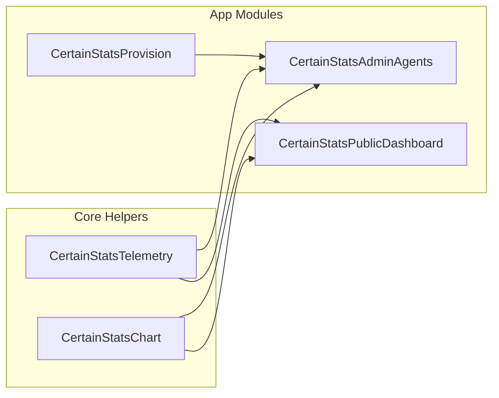

# CertainStats — Frontend Design Document

> **Version:** 3.0 · **Date:** 2026-08-26 · **Author:** Minoplhy

---

## 1. Design Philosophy

> **"Premium. Dense. Real-time. Dependency-Free."**

CertainStats UI delivers the speed and simplicity of server-rendered Web 1.0 combined with the smooth, instant reactivity of a Single-Page Application (SPA) — without requiring Node.js, npm, or heavy frontend runtime frameworks.

### Core Rules
1. **Status at a glance.** Any operator should know cluster and node health within 1 second of opening the panel.
2. **Hybrid Web 1.0 + In-Page SPA.** Fast initial HTML server-render (`<1ms`) via Go `html/template` with instant, client-side in-page navigation (`pushState`) for node inspection without full page reloads.
3. **Dark-first, light-supported.** Dark mode is the primary design canvas. Light theme is a first-class inversion with its own tuned token values.
4. **Zero noise & zero emojis.** Clean inline SVGs, crisp typography, and purposeful data hierarchy. No decorative clutter or emojis in operational controls.
5. **Monospace for telemetry.** All metric values, timestamps, public/agent IDs, and terminal instructions use `JetBrains Mono`. Human labels use `Outfit` (headings) and `Inter` (body).
6. **High-Performance Canvas Charting.** Dedicated custom HTML5 Canvas charting engine (`CertainStatsChart`) capable of 60 FPS rendering, drag-to-zoom, downtime gap visualization, and zero framework overhead.

---

## 2. Design Tokens

All tokens are defined in [`web/static/css/styles.css`] on `:root` (dark default) and `[data-theme="light"]`.

### 2.1 Color Palette

#### Dark Theme (default — `:root`)
```css
/* Backgrounds */
--bg-primary:          #0a0a0c;           /* Page background */
--bg-secondary:        #121318;           /* Cards, panels, modal content */
--bg-panel:            rgba(18, 19, 24, 0.88); /* Glassmorphic headers / toolbars */
--bg-hover:            rgba(255, 255, 255, 0.06);
--bg-active:           rgba(255, 255, 255, 0.12);

/* Borders */
--border-color:        rgba(255, 255, 255, 0.09);  /* Resting border */
--border-hover:        rgba(255, 255, 255, 0.20);  /* Hovered border */

/* Text */
--text-primary:        #ffffff;
--text-secondary:      #cbd5e1;
--text-muted:          #94a3b8;

/* Accent — Indigo */
--accent-primary:      #6366f1;             /* Buttons, active states, focus rings */
--accent-secondary:    #8b5cf6;             /* Gradient endpoint (violet) */
--accent-glow:         rgba(99, 102, 241, 0.35); /* Glow / box-shadow */

/* Semantic Status */
--status-online:       #10b981;  /* Emerald green */
--status-offline:      #ef4444;  /* Red */
--status-warning:      #f59e0b;  /* Amber */

/* Surface & Misc */
--card-shadow:         0 4px 20px rgba(0, 0, 0, 0.4);
--radius:              8px;
--track-bg:            rgba(255, 255, 255, 0.08);
--table-header-bg:     rgba(0, 0, 0, 0.25);
--table-hover-bg:      rgba(255, 255, 255, 0.025);
--input-bg:            #0a0a0c;
--modal-overlay-bg:    rgba(0, 0, 0, 0.72);
```

#### Light Theme (`[data-theme="light"]`)
```css
/* Backgrounds */
--bg-primary:          #f8fafc;
--bg-secondary:        #ffffff;
--bg-panel:            rgba(255, 255, 255, 0.95);
--bg-hover:            rgba(0, 0, 0, 0.04);
--bg-active:           rgba(0, 0, 0, 0.08);

/* Borders */
--border-color:        rgba(0, 0, 0, 0.10);
--border-hover:        rgba(0, 0, 0, 0.22);

/* Text */
--text-primary:        #0f172a;
--text-secondary:      #334155;
--text-muted:          #64748b;

/* Accent — Deeper Indigo */
--accent-primary:      #4f46e5;
--accent-secondary:    #7c3aed;
--accent-glow:         rgba(79, 70, 229, 0.18);

/* Semantic Status */
--status-online:       #059669;
--status-offline:      #dc2626;
--status-warning:      #d97706;

/* Surface & Misc */
--card-shadow:         0 4px 16px rgba(0, 0, 0, 0.06);
--track-bg:            rgba(0, 0, 0, 0.07);
--table-header-bg:     rgba(0, 0, 0, 0.04);
--table-hover-bg:      rgba(0, 0, 0, 0.02);
--input-bg:            #ffffff;
--modal-overlay-bg:    rgba(15, 23, 42, 0.50);
```

---

### 2.2 Metric Semantic Color Map

Metric series colors are fixed across all progress bars, odometer values, and Canvas chart lines:

| Metric | Category | CSS Variable | Hex (Dark) | Hex (Light) |
|---|---|---|---|---|
| **CPU Usage (User)** | CPU | `--metric-cpu` | `#3b82f6` | `#2563eb` |
| **CPU IO Wait** | CPU | `--metric-cpu-io` | `#fb923c` | `#ea580c` |
| **CPU Steal** | CPU | `--metric-cpu-stl` | `#ef4444` | `#dc2626` |
| **RAM Used** | Memory | `--metric-ram` | `#14b8a6` | `#0d9488` |
| **RAM Swap** | Memory | `--metric-swap` | `#64748b` | `#64748b` |
| **Disk Usage** | Storage | `--metric-disk` | `#a855f7` | `#9333ea` |
| **Network RX (Inbound)** | Network | `--metric-net-rx` | `#38bdf8` | `#0284c7` |
| **Network TX (Outbound)** | Network | `--metric-net-tx` | `#c084fc` | `#9333ea` |
| **Disk Read (Bps)** | Storage I/O | `--metric-disk-r` | `#f59e0b` | `#d97706` |
| **Disk Write (Bps)** | Storage I/O | `--metric-disk-w` | `#ef4444` | `#dc2626` |

---

### 2.3 Typography

```css
--font-sans:    'Inter', system-ui, -apple-system, sans-serif;
--font-display: 'Outfit', 'Inter', system-ui, sans-serif;
--font-mono:    'JetBrains Mono', 'Fira Code', monospace;
```

#### Type Hierarchy
| Scale | Size | Weight | Line Height | Font Family | Usage |
|---|---|---|---|---|---|
| **Display Title** | `26px` | `800` | `1.2` | Display | Page headers, main hero titles |
| **Card Heading** | `18px` | `700` | `1.3` | Display | Section titles, dashboard titles |
| **Subheading** | `14px` | `600` | `1.4` | Sans | Modal headers, card titles |
| **Body Text** | `13px` | `400` | `1.5` | Sans | Table rows, paragraphs, descriptions |
| **Section Label** | `11px` | `800` | `1.2` | Sans | Uppercase headers (`letter-spacing: 0.05em`) |
| **Telemetry Mono** | `13–16px` | `600` | `1.2` | **Mono** | Gauges, odometer values, stats, live Bps |
| **Code / Instructions** | `12px` | `500` | `1.4` | **Mono** | Terminal commands, token strings, IDs |
| **Micro Badge** | `10–11px` | `700` | `1.0` | Sans/Mono | Status chips, type badges, metric units |

---

## 3. Component System

### 3.1 Cards & Containers

#### `.card`
Standard container for stat panels, monitor rows, and configuration groups.
- `background: var(--bg-secondary)`
- `border: 1px solid var(--border-color)`
- `border-radius: var(--radius)` (`8px`)
- `padding: 20px` (desktop), `16px` (mobile)
- **Hover state** (on interactive cards): `border-color: var(--border-hover)`, `box-shadow: 0 4px 16px rgba(0,0,0,0.15)`.

#### `.hw-card`
Hardware specification card showing a live gauge and mini-meter (CPU Cores, RAM, Root Disk, Swap Size).
- Top row: hardware label + category badge.
- Middle row: value + unit (`vCPU`, `GB`, `MB`).
- Bottom row: `.hw-card-progress-track` with filled segment.

#### `.odometer-tile`
Real-time telemetry speed tile for Network Traffic and Disk R/W:
- Label group: Category name + sub-second indicator.
- Values row: Monospace live rates (e.g. `↓ 12.4 MB/s / ↑ 3.1 MB/s`).

#### `.cluster-stat-card`
Aggregate summary tile displayed at the top of the Multi-Agent Hub and Public Dashboard:
- 4-card grid (`Bandwidth`, `Disk I/O`, `Total Traffic`, `Total Read/Write`).
- Displays live aggregate telemetry summed across all monitored nodes.

---

### 3.2 Buttons

| Class | Appearance | Purpose |
|---|---|---|
| `.btn-primary` | Solid indigo background (`--accent-primary`), white text, subtle glow | Primary actions (Save, Add Agent, Create Alert) |
| `.btn-secondary` | Subtle tint background (`--btn-secondary-bg`), border | Secondary actions (Cancel, Reinstall, Uninstall, Filters) |
| `.btn-danger` | Red tint background (`--btn-danger-bg`), red border & text | Destructive actions (Delete Agent, Eject Session, Delete Alert) |
| `.btn-sm` | Compact sizing (`padding: 4px 10px`, `font-size: 11px`, `height: 28px`) | In-row actions, table actions, header controls |

---

### 3.3 Status Indicators & Badges

#### `.status-dot`
8×8px circle representing real-time heartbeat:
- `.online`: Emerald green with pulsing glow animation (`pulse-green`).
- `.offline`: Red solid dot (`--status-offline`).

#### `.badge`
Compact metadata chips:
- `.badge-online`: Emerald text on green alpha background.
- `.badge-offline`: Red text on red alpha background.
- `.badge-indigo`: Indigo text on indigo alpha background (used for agent types: `beszel`, `ltstats`, `hetrixtools`).

---

### 3.4 In-Place Notes System

Replicated directly from the original `frontend-admin` design with a zero-modal, dual-tier interaction model:

```
[ Monitor Header ]  ● Online  [beszel]  |  [No notes / short text / See below] notes
                                                 │
                                                 ├── Short/Empty → Click opens inline <input> in header
                                                 └── Long/Multiline → Click scrolls to #agent-notes-section
```

1. **Header Inline Notes Widget** (`#header-inline-notes`):
   - **Empty**: Displays `"No notes"`. Clicking switches to an inline `<input>` + `Save` + `✕` directly in the header bar.
   - **Short (≤ 40 chars & single line)**: Displays the note text with a dashed underline. Clicking opens the header inline editor.
   - **Long (> 40 chars or multiline `\n`)**: Displays `"See below"`. Clicking smoothly scrolls the viewport to `#agent-notes-section`.
2. **Expanded Notes Section** (`#agent-notes-section`):
   - Automatically appears below specifications when a note is long; hidden when short or empty.
   - Read mode: Pre-wrap formatted monospace card with an **Edit** button.
   - Edit mode: Expands into full `<textarea>` with **Save Note** and **Cancel** controls.
   - Saves persist via `PUT /api/agent` with live synchronization between the header and expanded view.

---

### 3.5 Modals & Overlays

All modals adhere to strict design standards:
- **Dismissal**: Clicking on the blurred background overlay dismisses the popup.
- **Typography & Icons**: No emojis; all modal tabs and action headers use clean, crisp inline SVGs.
- **Components**:
  - **Provisioning Modal** (`#provision-modal`): Driver selection (`Beszel`, `LTstats`, `HetrixTools`), Docker vs. binary tabs, copy-to-clipboard buttons, live token generation.
  - **Reinstall Modal**: Direct access to installation scripts for existing agent tokens.
  - **Uninstall Modal** (`#uninstall-modal`): Teardown commands and cleanup instructions for agents.

---

## 4. Interactive JavaScript Subsystems

The frontend relies on modular, dependency-free JavaScript components loaded via `<script>` tags with Subresource Integrity (SRI) hashes.



---

### 4.1 `CertainStatsTelemetry` ([`telemetry.js`])

The central utility module providing core primitives:
- **WebSocket Manager**: Connects to `/api/ws` with exponential backoff reconnection, heartbeat tracking, and message dispatching.
- **In-Page SPA Router (`initRouter`)**: Manages HTML5 `pushState` and `popstate` events to map URL paths (`/{agent_id}`) to view transitions without page reload.
- **Date & Time Picker (`initCustomTimePicker`)**: Dual-mode time window selector:
  - Preset hours pills: `1h`, `6h`, `24h`, `7d`, `30d`.
  - Custom Date Range Picker: Start/End datetime inputs with automatic timestamp conversion.
- **Formatters**: `formatBytes`, `formatBps`, `formatPercent`, `formatUptime`, `formatDate`.
- **Toast Notifications (`showToast`)**: Floating notification banner with auto-dismiss and color status.

---

### 4.2 `CertainStatsChart` ([`chart.js`])

A lightweight, zero-dependency HTML5 Canvas time-series charting engine:
- **High-DPI Rendering**: Automatically scales for Retina / 2x Displays using `window.devicePixelRatio`.
- **Chart Types**: Stacked Area Charts (e.g. CPU User / IO / Steal, Memory Used / Buffers / Cached) and Multi-Line Charts (e.g. Network RX/TX, Disk Read/Write).
- **Downtime Gap Shading**: Automatically detects data gaps (> 2.5× polling interval) and renders red vertical outage markers.
- **Interactive Drag-to-Zoom**: Click-and-drag across the time axis to select an arbitrary time range; triggers zoom callbacks.
- **Crosshair Hover Tooltip**: High-precision hover inspection displaying interpolated values and exact timestamps.

---

### 4.3 `CertainStatsAdminAgents` ([`admin_agents.js`])

Controls the private Multi-Agent Hub and In-Page Detail view:
- **View Density Modes**: Toggles between `detailed` (full segmented usage bars + mini legends) and `simplified` (compact usage meters).
- **Layout Modes**: Switches between Responsive Grid (`.grid-cards`) and Table List (`.table-view`).
- **Live Search Filtering**: Sub-millisecond client-side filtering across nicknames, hostnames, agent IDs, and IP addresses.
- **In-Page Detail Transition**:
  - Hides `#agents-overview-view`, displays `#agents-detail-view`.
  - Fetches multi-series TSDB telemetry via `/api/metrics`.
  - Initializes per-partition disk usage and I/O charts dynamically.
  - Synchronizes Header Inline Notes and Expanded Notes.

---

### 4.4 `CertainStatsPublicDashboard` ([`public_dashboard.js`])

Controls unauthenticated Public Status Pages (`/dashboard/{slug}`):
- **Access Rule Filtering**: Strictly respects `AllowedFeatures` and `AllowedMetrics` configured by the administrator.
- **In-Page SPA Navigation**: Allows public visitors to click into individual monitor details (`/{slug}/{pub_id}`) seamlessly in-place.
- **Time Window Clamping**: Enforces `MaxDays` history boundaries on all metric requests.

---

### 4.5 `CertainStatsProvision` ([`provision_renderer.js`])

Manages agent onboarding, reinstall instructions, and teardown scripts:
- Fetches setup metadata from `/api/agent/install/{id}` and `/api/agent/uninstall/{id}`.
- Renders driver-specific instructions for Docker, Docker Compose, Linux systemd, and Binary commands.
- Provides copy-to-clipboard functionality with visual feedback.

---

## 5. Page Specifications & Templates

All HTML templates reside in [`web/templates/`] and are compiled into the Go binary at build time.

### 5.1 Template Hierarchy

```
web/templates/
├── layout/
│   ├── base.html              # Authenticated Admin Shell (Navbar, Container, Live Dot, Footer)
│   └── public_base.html       # Public Unauthenticated Shell (Clean Header, Footer)
├── partials/
│   ├── agents/
│   │   ├── inpage_detail.html # In-Page Agent Detail View (#agents-detail-view)
│   │   └── provision_modal.html
│   ├── dashboards/
│   │   └── public_inpage_detail.html
│   └── common/
│       ├── time_picker.html
│       └── uninstall_modal.html
├── agents_list.html           # Main Multi-Agent Hub
├── agent_management.html      # Fleet Management Table (Tokens, SSH Keys, Reset)
├── dashboards_list.html       # Public Dashboards Manager
├── dashboard_edit.html        # Access Rules & Public Slug Editor
├── alerts_list.html           # Alerts & Webhook Targets Configurator
├── settings.html              # Password & Session Ejection Manager
├── login.html                 # Login View
└── setup.html                 # First-Time Admin Account Creation
```

---

### 5.2 Application Shell ([`layout/base.html`])

The main admin navigation bar contains:
- **Brand Logo**: CertainStats logomark linking to `/`.
- **Navigation Links**: `Monitors` (`/`), `Dashboards` (`/dashboards`), `Alerts` (`/alerts`), `Fleet Management` (`/agents/management`), `Settings` (`/settings`).
- **Live Stream Indicator**: Green pulse dot showing active WebSocket connection status.
- **Theme Toggle**: In-place dark/light toggle persisting preference in `localStorage`.
- **Logout Form**: Secure POST `/logout`.
- **Footer**: Displays server render time (e.g. `Render Time: 0.35ms`), copyright, and version.

---

### 5.3 Page Route Map

| URL Route | Template | JavaScript Entry | Key Functionality |
|---|---|---|---|
| `/` | `agents_list.html` | `admin_agents.js` | Multi-Agent Hub Overview (Grid/List, Density modes, Search) |
| `/{agent_id}` | `agents_list.html` | `admin_agents.js` | In-Page Detail SPA for specific node (Telemetry, Disks, Notes) |
| `/agents/management` | `agent_management.html` | `provision_renderer.js` | Fleet table, Pre-shared tokens, SSH Key rotation |
| `/dashboards` | `dashboards_list.html` | — | Dashboard management list |
| `/dashboard/create` | `dashboard_edit.html` | `dashboard_edit.css` | Create new public dashboard |
| `/dashboard/{id}` | `dashboard_edit.html` | `dashboard_edit.css` | Configure slug, Access Rules, and assigned agents |
| `/alerts` | `alerts_list.html` | — | Alert rule builder and Webhook targets (Discord, etc.) |
| `/settings` | `settings.html` | — | Password change and active session revocation |
| `/login` | `login.html` | — | User authentication |
| `/first-time-setup` | `setup.html` | — | Initial administrator provisioning |
| `/dashboard/{slug}` | `public_dashboard.html` | `public_dashboard.js` | Public Status Page Overview |
| `/dashboard/{slug}/{pub_id}` | `public_dashboard.html` | `public_dashboard.js` | Public Status Page In-Page Monitor Detail |

---

## 6. Performance & Asset Pipeline

### 6.1 Sub-Millisecond Server Rendering
- Templates are pre-parsed on startup via `NewTemplateRenderer` in `renderer.go` into memory.
- Typical page render time is **< 0.50 ms**, recorded in the response footer via `PageData.RenderTime()`.

### 6.2 Asset Embedding & Minification
- Static assets (CSS, JS) and templates are embedded into the Go binary using `embed.FS` in `web/embed.go`.
- Assets are minified at startup using `internal/minify` and served with cache-busting SHA-256 asset hashes.

### 6.3 In-Memory Output Caching
- Public status pages utilize `DashboardHTMLCache` (`internal/context/cache.go`) with configurable TTLs, invalidating immediately whenever dashboard configurations change.
