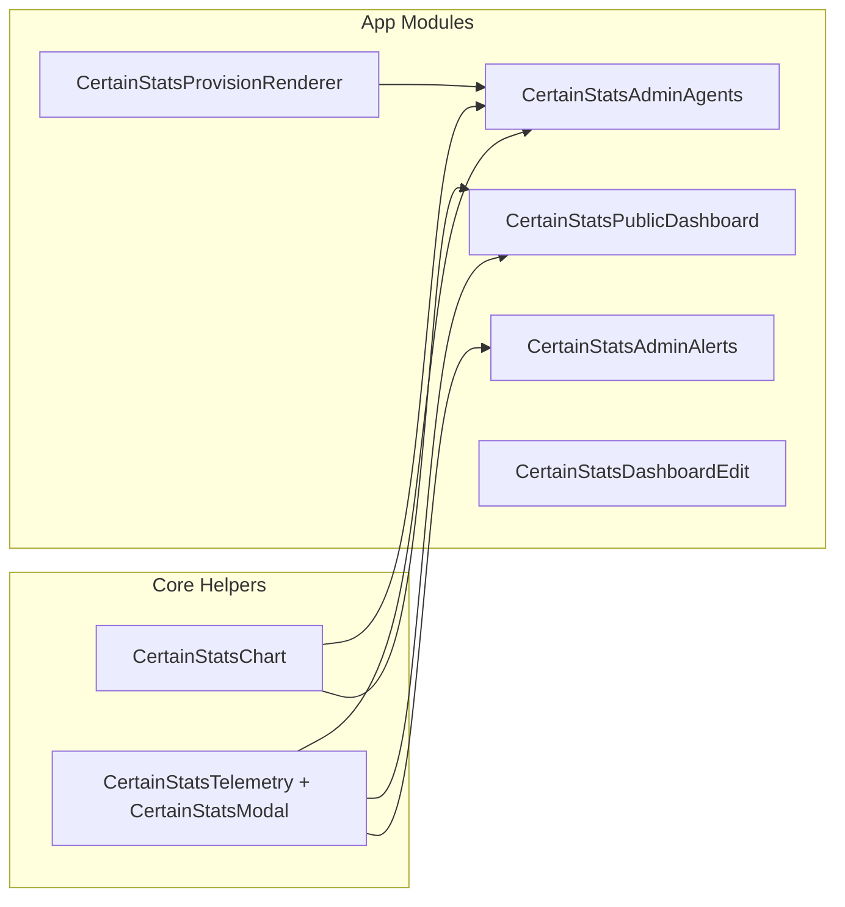

# CertainStats — Frontend Design Document

> **Version:** 4.0 · **Date:** 2026-10-02 · **Author:** Minoplhy
>
> Version 4 is the "Editorial" redesign: light-first with a tuned dark theme, a deep teal accent, plain-language page headlines and self-hosted type.

---

## 1. Design Philosophy

> **"Calm, legible, real-time. Dependency-free."**

CertainStats renders pages on the server with Go `html/template` and makes them live with small vanilla JS modules. There is no Node.js build, npm package or frontend framework at runtime.

### Core Rules
1. **Say the state in words first.** Each main page opens with a headline that states the situation ("1 node is offline. The other 5 are healthy."), then shows the numbers.
2. **Hybrid server render + in-page navigation.** HTML is rendered on the server in under 1ms. Opening an agent detail swaps views in place with `pushState`, without a full page load.
3. **Light-first, dark as an equal.** Light is the default palette. Dark is tuned separately rather than inverted. The user picks **system**, **light** or **dark**, and system is the default.
4. **Color means something.** Teal is the only accent and is used for actions and focus. Green, amber and red appear only for status. Series colors only appear in charts and meters.
5. **Monospace for telemetry.** Every metric value, timestamp, ID and command uses Geist Mono. Headings use Bricolage Grotesque and UI text uses Figtree.
6. **No emojis or glyph icons.** Icons are inline SVG with `aria-hidden="true"`. Decorative Unicode glyphs (⇅ ⛁ ☁) are not used.
7. **Accessible by default.** Visible `:focus-visible` rings, native `<dialog>` modals, labelled controls, `aria-live` status regions and `prefers-reduced-motion` support.
8. **Custom canvas charts.** `CertainStatsChart` draws on HTML5 Canvas and reads every color from CSS tokens, so charts follow the theme.

---

## 2. Design Tokens

All tokens are defined at the top of [`web/static/css/styles.css`](../web/static/css/styles.css). Light values sit on `:root`, and dark values on `[data-theme="dark"]`. Components reference tokens only. Templates and scripts contain no color literals.

### 2.1 Color Palette

| Token | Light | Dark | Role |
|---|---|---|---|
| `--bg` | `#f6f7f9` | `#0d1214` | Page background |
| `--surface` | `#ffffff` | `#131a1d` | Cards, tables, dialogs |
| `--surface-2` | `#eef1f4` | `#192225` | Hover rows, segmented control track, code chips |
| `--line` / `--line-strong` | `#dde2e8` / `#c9d0d8` | `#243034` / `#33444a` | Borders and dividers |
| `--text` / `--text-2` / `--muted` | `#101820` / `#33404c` / `#56616e` | `#e8eef0` / `#c2ced2` / `#8fa0a6` | Primary, secondary, tertiary text |
| `--accent` / `--accent-soft` | `#0e7c6b` / `#e0f1ed` | `#3cc4ac` / `#123430` | Primary buttons, links, focus, selection |
| `--ok` / `--ok-soft` | `#15924f` / `#e2f3e8` | `#3fcf7f` / `#10291c` | Online, delivered, operational |
| `--warn` / `--warn-soft` | `#a96d14` / `#f7eddc` | `#e6aa3c` / `#30230f` | Partial outage, disk ≥ 90% |
| `--bad` / `--bad-soft` | `#c8372d` / `#f8e6e4` | `#f0645a` / `#33171a` | Offline, firing, destructive actions |
| `--grid` / `--track` | `#e9edf1` / `#e8ecf0` | `#1d272a` / `#1f292c` | Chart gridlines, meter tracks |

Legacy names (`--bg-primary`, `--accent-primary`, `--metric-cpu`, `--status-online`, …) are kept as aliases of these tokens for compatibility. New code should use the names above.

### 2.2 Series Colors

Fixed per metric across meters, legends, tooltips and charts:

| Token | Light | Dark | Used for |
|---|---|---|---|
| `--s1` | `#0e7c6b` | `#3cc4ac` | CPU user, disk used, sparklines |
| `--s2` | `#c98a1c` | `#e6aa3c` | CPU IO wait, disk read |
| `--s3` | `#c8372d` | `#f0645a` | CPU steal, disk write |
| `--s4` | `#3b6fd8` | `#7aa2ff` | RAM used |
| `--s5` | `#a2abb6` | `#56656b` | Swap used |
| `--rx` / `--tx` | `#0e7c6b` / `#3b6fd8` | `#3cc4ac` / `#7aa2ff` | Network download / upload |

Swatch helpers `.sw-s1` … `.sw-tx` color legend marks. Scripts pass series colors as token names (`'--s1'` or `'var(--s1)'`), which `CertainStatsChart.resolveColor` turns into the current theme's value.

### 2.3 Typography

Fonts are self-hosted as Latin-subset variable woff2 files in [`web/static/fonts/`](../web/static/fonts/) (SIL OFL, license files alongside). Public pages make no third-party font requests.

```css
--font-head: 'Bricolage Grotesque', 'Figtree', system-ui, sans-serif;
--font-body: 'Figtree', system-ui, -apple-system, 'Segoe UI', sans-serif;
--font-mono: 'Geist Mono', ui-monospace, 'SFMono-Regular', Menlo, monospace;
```

| Role | Size | Weight | Family | Usage |
|---|---|---|---|---|
| Hero headline (`.hero-title`, `.detail-title`, `.status-title`) | `clamp(26px, 3.4vw, 38px)` | 650 | Head | Page-opening sentence or entity name |
| Page title (`.page-title`) | 30px (24px mobile) | 650 | Head | Form pages |
| Section title (`.section-title`, `.chart-header-title`) | 16–18px | 650 | Head | Sections, chart cards, dialogs |
| Body | 14px | 400–600 | Body | Text, tables, forms |
| Label / hint | 12–13px | 500 | Body | Field labels, hints, eyebrow lines |
| Telemetry figure | 17–28px | 500 | **Mono** | Hero stats, agent metrics, tiles |
| Data / code | 11–13px | 400–500 | **Mono** | IDs, rates, axis labels, commands |

### 2.4 Shape & Spacing

- Radius: `--r` 10px (controls), `--r-lg` 16px (cards, dialogs), `--r-sm` 6px (small buttons, chips).
- Content column: `--content-w` 1180px, with a 32px side gutter on desktop and 16px on mobile.
- Shadows are only used for elevated surfaces (dialogs, popovers, tooltips): `--shadow-pop`.

---

## 3. Component System

### 3.1 Page Openers
- **`.hero`**: an eyebrow line (`.hero-eyebrow`), a sentence headline (`.hero-title`), optional `.page-subtitle`, `.hero-stats` and `.hero-actions`. Used on Agent Hub, Status pages, Alerts, Management and Settings.
- **Agent Hub headline**: rendered on the server by the `hub_headline` template (`partials/agents/headline.html`) from `OnlineCount` and `OfflineCount`, and re-rendered by `renderHubHeadline()` in `admin_agents.js` after a metadata sync. Offline wording uses `.is-bad`.
- **`.hero-stats`**: fleet figures (bandwidth now, disk I/O now, traffic and disk all time). They keep the `admin-live-*` and `admin-total-*` element IDs that `renderClusterStats` writes to, with `pub-*` IDs on the public page.

### 3.2 Cards
- **`.card`**: surface, 1px `--line` border, `--r-lg` radius, 20px padding. Cards carry no shadow.
- **`.agent-card-item`**: an Agent Hub card containing:
  - a name with status dot, CPU model and driver;
  - a status badge;
  - three large figures (CPU %, memory %, disk %), each with a thin meter;
  - a 24h CPU sparkline (`canvas.agent-spark`);
  - a footer with live network rates and uptime.

  Offline cards add `.is-offline`, which applies a `--bad-soft` wash.
- **`.chart-card`**: a chart container with a title, legend (`.chart-legend-pills`) and `.chart-container` canvas. `.chart-card-wide` spans both columns of `.chart-grid`.
- **`.partition-card`**: per-mount storage card, rendered by `CertainStatsTelemetry.partitionCardHtml()`, which both detail views share.
- **`.hw-card`**: a detail metric tile with a label, capacity, live value and meter.

### 3.3 Buttons

| Class | Appearance | Purpose |
|---|---|---|
| `.btn-primary` | Solid `--accent`, `--accent-fg` text | One primary action per area |
| `.btn-secondary` | Surface with `--line` border | Secondary actions |
| `.btn-ghost` | Transparent, muted text | Tertiary actions, icon buttons |
| `.btn-danger` | Red text and border, fills red on hover | Destructive actions |
| `.btn-sm`, `.btn-icon`, `.btn-block` | Size modifiers | Row actions, icon-only buttons, full width |

Button labels say exactly what happens ("Create status page", "Sign out other devices").

### 3.4 Status
- **`.status-dot`**: 8px dot with a soft ring. Classes: `.online`, `.offline`.
- **`.badge`**: pill chip. Variants: `.badge-online`, `.badge-offline` (each with a leading dot), `.badge-warn` and `.badge-accent` (`.badge-indigo` is an alias).
- **`.banner`**: full-width status strip. Variants: `.is-ok`, `.is-warn`, `.is-bad`. It's used for the public "All systems operational / Partial outage" banner and the Alerts incident banner.

### 3.5 Meters
`.usage-bar-track` with `.usage-segment` children; segments start at zero width and JS sets `style.width`. Series classes are `.seg-cpu-usr`, `.seg-cpu-io`, `.seg-cpu-stl`, `.seg-ram-used`, `.seg-ram-swap`, `.seg-disk` (`.is-high` above 90%), `.seg-net-rx` and `.seg-net-tx`. A track with `data-tooltip-rows` shows the floating tooltip, whose row colors are CSS values such as `var(--s2)`.

### 3.6 Controls
- **Segmented control**: `.toolbar-group` / `.time-range-bar` containing `.toolbar-btn` / `.time-range-btn`, with `.active` and `aria-pressed`.
- **Search**: `.toolbar-search` label with an SVG icon and an `input[type=search]`.
- **Forms**: `.form-group`, `.form-label`, `.form-input` / `.form-select` / `.form-textarea`, `.form-hint`, `.form-grid-2`, `.input-prefix` (address prefix), `.toggle-pill` (checkbox chip), `.node-select-pill` and `.form-fieldset`.
- **Tables**: `.table-responsive` (a positioned scroll container) holding a `.table`. Helpers: `.table-actions`, `.table-link`, `.table-empty`.
- **Empty states**: `.empty-state` with `.empty-state-title`, a sentence, and the action that fixes it.

### 3.7 In-Place Editing
Agent rename and short notes are edited inline in the detail header; this is unchanged in behavior from v3. Read and edit states are toggled with the `hidden` attribute. `.editable-title` is focusable (`role="button"`, `tabindex="0"`, Enter starts editing), Enter saves and Escape cancels. Long notes (> 40 characters or multiline) appear in an expanded notes card under the metric tiles.

### 3.8 Dialogs
All modals are native `<dialog class="modal">` elements opened with `showModal()`, which gives the focus trap, Esc to close and `::backdrop` for free.

- Structure: `.modal-header` (`.modal-title`, `.modal-subtitle`, `{{template "modal_close"}}`), then `.modal-body` (scrolls), then `.modal-footer`. Inside a `<form>`, the form wraps the body and footer.
- Open and close from markup with `data-open-modal="id"` and `data-close-modal` (closes the enclosing dialog). From JS, use `CertainStatsModal.open(id)` and `CertainStatsModal.close(id)`.
- A click on the backdrop closes the dialog. Use `.modal-lg` for wide dialogs.
- Current dialogs:
  - agent dialogs: add agent, notes, reinstall, uninstall;
  - alert dialogs: new and edit rule, new and edit target, template variables;
  - delete status page;
  - confirm (shared, see below).
- **Confirmations.** Use the shared `{{template "confirm_modal"}}` partial instead of `window.confirm()`.
  - A form opts in with `data-confirm="message"`, plus optional `data-confirm-title`, `data-confirm-label`, `data-confirm-danger` and `data-confirm-match` (text the user must type before the button enables; use it for deletes).
  - `data-confirm-flash` is shown as a toast on the page the submit lands on (stored in `sessionStorage`).
  - From JS, `CertainStatsModal.confirm({title, message, label, danger, match})` returns a `Promise<boolean>`.
  - Currently used on the Management page. Other pages still use `confirm()` and can move over.

### 3.8.1 Credentials
Secrets (agent tokens) render masked through the `maskSecret` template func (12 dots plus the last four characters). The real value lives in `data-secret` on the `<code class="secret">` element: a Show button swaps it in, and Copy always copies the full value. Masking is for screen-sharing and shoulder-surfing, not access control; the value is still in the page source of an authenticated page. Long values such as SSH keys and agent IDs are shortened with `middleTrim` and carry the full value in `title`.

### 3.9 Theme Toggle
The `{{template "theme_toggle"}}` icon button cycles **system → light → dark** and stores the preference in `localStorage.certainstats_theme`.

- The `{{template "theme_bootstrap"}}` inline script resolves the preference to `data-theme="light|dark"` before first paint, so there is no flash. It also sets `data-theme-pref`.
- When the preference is `system`, a `matchMedia` listener follows OS changes.
- Every change dispatches `certainstats_theme_change`, which charts and sparklines listen for to redraw.

---

## 4. Interactive JavaScript Subsystems

Dependency-free modules loaded with `<script>` tags carrying SRI hashes.


```mermaid
flowchart LR
    subgraph Core Helpers
        Telemetry[CertainStatsTelemetry + CertainStatsModal]
        ChartEngine[CertainStatsChart]
    end
    subgraph App Modules
        Admin[CertainStatsAdminAgents]
        Public[CertainStatsPublicDashboard]
        Provision[CertainStatsProvisionRenderer]
        Alerts[CertainStatsAdminAlerts]
        DashEdit[CertainStatsDashboardEdit]
    end

    Telemetry --> Admin
    Telemetry --> Public
    Telemetry --> Alerts
    ChartEngine --> Admin
    ChartEngine --> Public
    Provision --> Admin
```

### 4.1 `CertainStatsTelemetry` ([`telemetry.js`])
- **WebSocket manager** for `/api/ws` and `/api/public/ws/{id}`, with reconnection.
- **In-page router (`initRouter`)** maps `/{agent_id}` and `/{slug}/{pub_id}` to view swaps.
- **Time range picker (`initCustomTimePicker`)**: quick ranges plus a custom start and end dropdown with `aria-expanded`. Public pages clamp the range to `MaxDays`.
- **`renderClusterStats`** updates the hero figures, the public header status and the public status banner.
- **`partitionCardHtml`** renders the shared storage partition card.
- **Floating tooltips** on meters, **toasts**, and **`CertainStatsModal`** (open/close plus the delegated `data-open-modal`/`data-close-modal` handlers).

### 4.2 `CertainStatsChart` ([`chart.js`])
- **Colors from tokens**: grid, axis text, tooltip card, downtime band and drag selection all read CSS variables, and series colors go through `resolveColor`.
- **Style**:
  - smooth curves (horizontal midpoint bezier, so no overshoot) with a 2px stroke and soft gradient area;
  - a marked latest point (a dot with a ring in the surface color);
  - offline gaps drawn as a red band labelled "Offline 42m".
- **Fitted y-axis gutter**: the left padding grows to fit the widest label.
- **Drag to zoom**, a **crosshair tooltip**, and **High-DPI** rendering.
- **`drawSparkline(canvas, points, opts)`**: axis-less trend line for Agent Hub cards, split at data gaps.
- **Theme**: `initThemeToggle` handles the three-way preference described in §3.9.

### 4.3 `CertainStatsAdminAgents` ([`admin_agents.js`])
- Switches between card and table views (persisted), and filters by name, CPU or ID.
- Applies live WebSocket snapshots to cards, table rows and the open detail view. Element IDs are the contract between templates and this script, so keep them stable.
- Loads 24h CPU sparklines (`/api/metrics?…&hours=24`), staggered per card.
- Re-renders the headline and offline card washes after each metadata sync.

### 4.4 `CertainStatsPublicDashboard` ([`public_dashboard.js`])
- Status rows (the default view) or cards, persisted per visitor.
- Strictly respects `AllowedFeatures` and `AllowedMetrics`. Templates use `hasFeature` and `hasMetric`, and scripts check `pubAllowedMetrics`.
- Public agent detail is rendered in place at `/dashboard/{slug}/{pub_id}` with the same structure as the admin detail, minus admin actions.

### 4.5 `CertainStatsProvisionRenderer` ([`provision_renderer.js`])
Agent onboarding, install and uninstall instructions, with copy buttons. Driver choice is a `radiogroup` of `.driver-select-card` buttons.

### 4.6 `CertainStatsDashboardEdit` ([`dashboard_edit.js`])
Status page editor:
- server selection and aliases;
- drag-to-reorder, plus up and down buttons for keyboard users (`data-move`);
- order is submitted as repeated `agents_order` hidden inputs with the `is_dragged` flag.

---

## 5. Page Specifications & Templates

### 5.1 Template Hierarchy

```
web/templates/
├── layout/
│   ├── base.html              # Admin shell: skip link, navbar, mobile subnav, flash, footer
│   └── public_base.html       # Public shell: page title + live status, theme toggle
├── partials/
│   ├── common/
│   │   ├── shell.html         # theme_bootstrap, logo_mark, theme_toggle, modal_close
│   │   ├── reinstall_modal.html
│   │   └── uninstall_modal.html
│   ├── agents/                # headline, cluster_cards (hero stats), toolbar, grid/list views,
│   │                          # inpage_detail, provision_modal, notes_modal
│   ├── public/                # cluster_cards, toolbar, grid_view (cards), list_view (status rows),
│   │                          # public_inpage_detail
│   ├── alerts/                # rules/targets/history tables, incidents banner, dialogs
│   └── settings/              # password_form, sessions_table
├── agents_list.html           # Agent Hub + in-page agent detail
├── agent_management.html      # Agent credentials (tokens, SSH keys, resets)
├── dashboards_list.html       # Status pages list
├── dashboard_edit.html        # Status page editor
├── alerts_list.html           # Alert rules, targets, incident history
├── settings.html              # Password and signed-in devices
├── login.html
├── setup.html
└── public_dashboard.html      # Public status page + in-page public agent detail
```

### 5.2 Application Shell
- **Brand**: SVG logo mark (a pulse line in a rounded teal square) with the "CertainStats" wordmark.
- **Navigation**: Agent Hub, Dashboards, Alerts, Management, Settings. The active link has `aria-current="page"` and a teal underline. On mobile the links move to a horizontally scrolling subnav.
- **Right side**: theme toggle and Log out.
- **Navbar**: translucent and sticky. It gains a bottom border once the page scrolls (`.is-scrolled`).
- **Footer**: copyright and server render time ("Rendered in 0.35ms").

### 5.3 Page Route Map

| URL Route | Template | JavaScript Entry | Key Functionality |
|---|---|---|---|
| `/` | `agents_list.html` | `admin_agents.js` | Agent Hub: headline, fleet figures, cards/table, search, sparklines |
| `/{agent_id}` | `agents_list.html` | `admin_agents.js` | In-page agent detail: tiles, storage, history charts, notes |
| `/agents/management` | `agent_management.html` | `agent_management.js`, `provision_renderer.js` | Expandable credential rows: masked token, SSH key, rename, install steps, resets, delete; search |
| `/dashboards` | `dashboards_list.html` | `admin_modals.js` | Status pages list |
| `/dashboards/new`, `/dashboards/{id}` | `dashboard_edit.html` | `dashboard_edit.js` | Address, visibility rules, servers, order |
| `/alerts` | `alerts_list.html` | `admin_alerts.js` | Rules, targets, incident history |
| `/settings` | `settings.html` | `admin_modals.js` | Password change, signed-in devices |
| `/login`, `/first-time-setup` | `login.html`, `setup.html` | — | Sign in, initial administrator account |
| `/dashboard/{slug}` | `public_dashboard.html` | `public_dashboard.js` | Public status page |
| `/dashboard/{slug}/{pub_id}` | `public_dashboard.html` | `public_dashboard.js` | Public agent detail |

---

## 6. Performance & Asset Pipeline

### 6.1 Sub-Millisecond Server Rendering
- Templates are pre-parsed on startup via `NewTemplateRenderer` in `renderer.go` into memory.
- Typical page render time is **< 0.50 ms**, shown in the footer via `PageData.RenderTime()`.

### 6.2 Asset Embedding & Minification
- Static assets (CSS, JS, fonts) and templates are embedded into the Go binary using `embed.FS` in `web/embed.go`.
- CSS and JS are minified at startup by `internal/minify` and served under content-hashed names with SRI. Fonts pass through unchanged and are referenced by stable paths (`/static/fonts/*.woff2`).
- The CSS minifier keeps whitespace that changes meaning: around `(` in media queries, after `)` in selectors such as `:not(…) .x`, and inside `calc()` and `color-mix()`.

### 6.3 In-Memory Output Caching
- Public status pages use `DashboardHTMLCache` (`internal/context/cache.go`) with configurable TTLs, invalidated when dashboard configuration changes.
